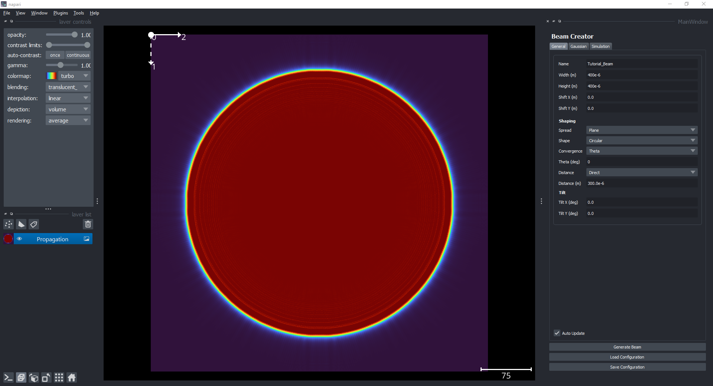
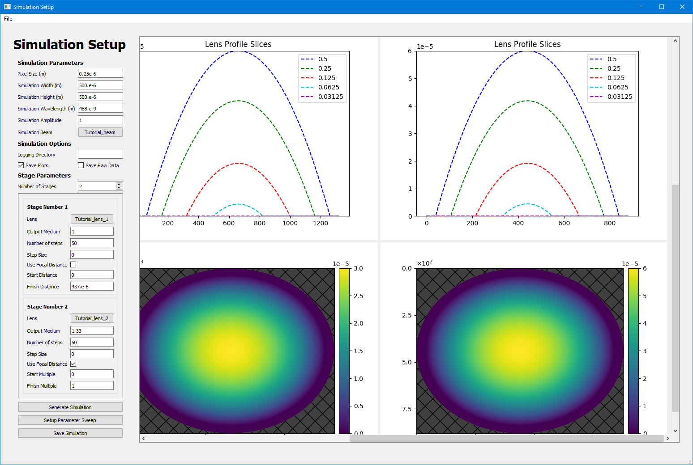

# Documentation

This document contains the explanations for the simulation structure, coordinate systems and general overview

N.B: This software is currently in development and breaking changes may be made.

## Simulation Structure
Lens simulations operates using free space wave propagation.

The structure of the simulation can be clasified into three main components:
- Beam: The initial wave propagation into the system
- Lens: The lens profile under analysis 
- Output Medium: the output medium which the lens propagates into. 

<figure>
  
  <figcaption style="text-align:center">Simulation Structure Definitions</figcaption>
</figure>

We refer to the collection of Lens -> Ouput Medium pairs as a simulation stage. Multiple simulation stages may be chained together to form long optical systems. 

Therefore, the simulation can be summarised as having the basic structure:

Beam -> Lens -> Output -> Lens -> Output

Beam -> Stage -> Stage (where Stage = Lens/Beam -> Output)

(Note: under the hood, the beam is also a stage that can be customised in the same way (e.g refractive index, propagation distances). However, it is a special case as it defines the initial propagation into the system and so it is better to think of it separately.)

## Definitions

### Coordinate Systems
Propagation along the optical axis is refered to as the z-axis. 

- z-axis: out of the page, positive out
- x-axis: horizontal, positive right
- y-axis: vertical, positive down

TODO: IMAGE / DIAGRAM

## User Interface
We provide several user interfaces for creating each element of the simulation.

### Lens Creator
This interface allows you to create, save and load lens profiles. Standard profiles are defined by a diameter, height, exponent and lens type (cylindrical or spherical). Additional modifiations such as gratings, escape paths, truncation and apertures also be applied.

<figure>
  
  <figcaption style="text-align:center">Lens Creator</figcaption>
</figure>

### Beam Creator
This interface allows you to create and save the initial beam setup. A beam defines the initial propagation into the simulation and can be modified in a number of ways, including size, shape, spread, distance, tilt and other properties.

<figure>
  
  <figcaption style="text-align:center">Beam Creator</figcaption>
</figure>

### Simulation Setup
This interface allows you to create, save and load a simulation configuration. The configuration defines your simulation setup and includes:
- Global Simulation Parameters: e.g. simulation width, height, pixel_size and wavelength
- Simulation Options: e.g. logging directory, simulation name
- Beam Settings: the beam configuration
- Stage Settings: a combination of a lens configuration and output settings, e.g. output medium, propaagation distances and step sizes. 

This interface also allows you to setup parameter sweeps for most numerical parameters in the simulation. This allows you to run a large number of simulation combinations easily.

<figure>
  
  <figcaption style="text-align:center">Simulation Setup</figcaption>
</figure>

### Run Simulation
This interface allows you to load a simulation config and run the simulations. A progress bar will display the overall progress of the simulations.

<figure>
  
  <figcaption style="text-align:center">Run Simulation UI</figcaption>
</figure>

### Visualise Results
This interface allows you to load multiple simulations, filter the results, and visualise the propagation. 

<figure>
  
  <figcaption style="text-align:center">Simulation Visualisation UI</figcaption>
</figure>

The interface also provides functionality to load the full simulation propagation in napari for interactive exploration. For simulations of the same shape, you can explore these all at once by pressing the view all button. 

<figure>
  
  <figcaption style="text-align:center">Simulation Visualisation Napari</figcaption>
</figure>

## Additional Notes

### "Double Sided Lens"
If you define a simulation stage that contains a lens and output with the same medium, the simulation will assume you want to create a double sided lens. This will try to invert the lens profile and medium at the inlet, by constructing the inverted profile from the previous output's medium instead. 

<figure>
  
  <figcaption style="text-align:center">Double Sided Lens</figcaption>
</figure>
