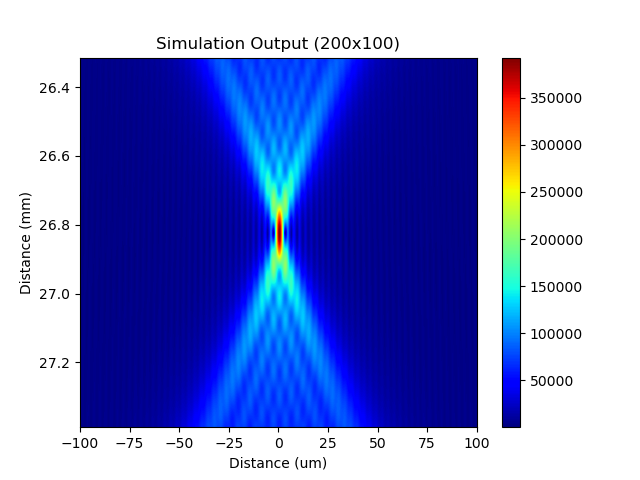

# [PACKAGE_NAME]
 [PACKAGE_NAME] is python package for designing lens by performing full wave simulations.

<figure>
  
  <figcaption style="text-align:center">Simulation Image</figcaption>
</figure>

## Getting Started


### Installation

The best way to install is by creating an [Anaconda](https://docs.conda.io/projects/conda/en/latest/user-guide/getting-started.html) environment. First download and install anaconda.

On Windows - Open Anaconda Powershell Prompt:

On Linux/Mac - Open Terminal:

``` bash
$ git clone https://github.com/DeMarcoLab/lens_simulation.git
$ cd lens_simulation
$ conda create --name lens_sim python=3.8 pip
$ conda activate lens_sim
$ pip install -r requirements.txt
$ pip install -e .

```

### Tutorial
For a tutorial walkthrough for using the package please see [Tutorial.md](TUTORIAL.md)


### User Interface

To run the user interface:
```bash
$ cd src/lens_simulation
$ python ui/main.py
```

### Examples
The example folder contains a few simulation configurations using common lens types and setups:
 - Focusing Lens (1D and 2D)
 - Axicon Lens (2D)
 - Telescope (1D and 2D)

For more information about all the available configuration parameters and options, please see [Configuration.md](Configuration.md).


### Command Line

Simulations can be run from the commmand line.
```bash
$ python run_simulation.py config.yaml
```
This is useful for running large parameter sweeps on HPC setups.


## Technical Details

TODO

ZARR


## Simulation Structure


## Citation
TODO

## Tests
[](https://github.com/DeMarcoLab/lens_simulation/actions/workflows/python-package.yml)