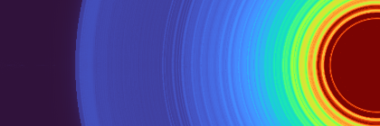

<figure>
  
</figure>

# Juno
juno is python package for designing lenses by performing full wave simulations.

## Getting Started

### Installation

The best way to install is by creating an [Anaconda](https://docs.conda.io/projects/conda/en/latest/user-guide/getting-started.html) environment. First download and install anaconda.

On Windows - Open Anaconda Powershell Prompt:

On Linux/Mac - Open Terminal:

``` bash
$ git clone https://github.com/DeMarcoLab/juno.git
$ cd juno
$ conda env create -f environment.yml
$ conda activate juno
$ pip install -e .

```

### Documentation

For more documentation, please see the [website](https://demarcolab.github.io/juno)


### Tutorial
For a tutorial walkthrough for using the package please see [Tutorial](https://demarcolab.github.io/juno/TUTORIAL)


### User Interface

To run the user interface:
```bash
$ juno_ui
```

### Examples
The example folder contains a few simulation configurations using common lens types and setups:
 - Focusing Lens (1D and 2D)
 - Axicon Lens (2D)
 - Telescope (1D and 2D)

For more information about all the available configuration parameters and options, please see [Configuration](https://demarcolab.github.io/juno/Configuration/).


### Command Line

Simulations can be run from the commmand line.
```bash
$ python run_simulation.py config.yaml
```
This is useful for running large parameter sweeps on HPC setups.


### Documentation
For more detailed documentation please see [Documentation](https://demarcolab.github.io/juno/Documentation)


## Citation
```
@misc{https://doi.org/10.48550/arxiv.2212.12540,
  doi = {10.48550/ARXIV.2212.12540},
  
  url = {https://arxiv.org/abs/2212.12540},
  
  author = {Dierickx, David and Cleeve, Patrick and Gorelick, Sergey and Whisstock, James C. and De Marco, Alex},
  
  keywords = {Instrumentation and Detectors (physics.ins-det), Numerical Analysis (math.NA), Optics (physics.optics), FOS: Physical sciences, FOS: Physical sciences, FOS: Mathematics, FOS: Mathematics},
  
  title = {Juno: a Python-based graphical package for optical system design},
  
  publisher = {arXiv},
  
  year = {2022},
  
  copyright = {Creative Commons Attribution Share Alike 4.0 International}
}

```

## Tests
[](https://github.com/DeMarcoLab/juno/actions/workflows/python-package.yml)
