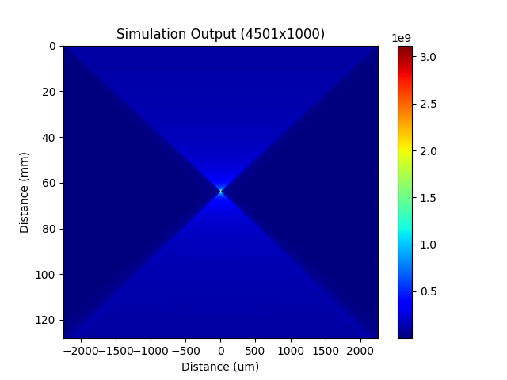

# Lens Simulation
 A lens simulation package.

<figure>
  
  <figcaption style="text-align:center">Simulation Image</figcaption>
</figure>

## Getting Started


### Install

```
$ cd lens_simulation
$ python3 -m pip install --upgrade build
$ python3 -m build
$ python3 -m pip install -e .
```

## Configuration


In the config.yaml file:

### Define your simulation parameters

```yaml
sim_parameters:
  A: 10000
  pixel_size: 1.e-6 
  sim_width: 4500.e-6
  sim_wavelength: 488.e-9

```


### Define your mediums
Define the refractive index of the Lens and Output mediums.
```yaml
mediums:
  - name: medium_1
    refractive_index: 2.348
```
### Define your lenses
Define the medium and profile for each lens.
```yaml
lenses:
  - name: lens_1
    height: 70.e-6
    exponent: 0.0
    medium: medium_1
```
The name of the medium needs to be the same as defined in mediums.

### Define your simulation stages
Define the stages for the simulation to run. Simulation will be run in the order these stages are defined in.

```yaml
stages:
  - lens: lens_1
    output: medium_1 
    n_slices: 100 
    start_distance: 0
    finish_distance: 10.0e-3 
    options: 
      use_equivalent_focal_distance: False
      focal_distance_multiple: 2.0
  - lens: lens_2
    output: medium_2 
    n_slices: 1000 
    start_distance: 0
    finish_distance: 10.0e-3 
    options: 
      use_equivalent_focal_distance: True
      focal_distance_multiple: 2.0 
```

## Simulating
To run the simulation:

Open a terminal
```bash
$ python run_simulation config.yaml
```

Simulations results will be saved into the log/ directory. 

# Profiling
```bash
$ pip install snakeviz

$ python -m cProfile -o output.profile script.py

$ snakeviz output.profile
```


# Coverage

```bash

$ pip install coverage
$ coverage run -m pytest -vv
$ coverage report -m 
$ coverage html
```


### Citation 
TODO