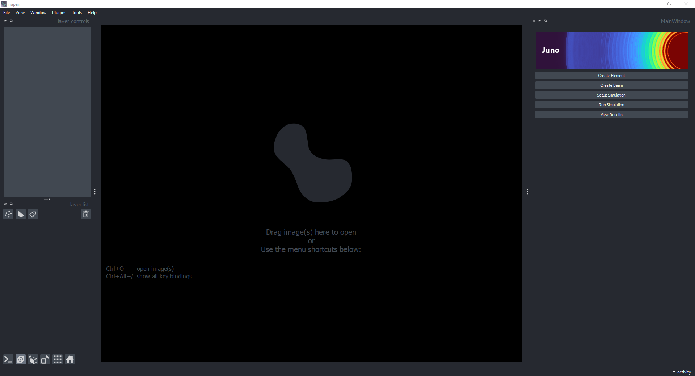
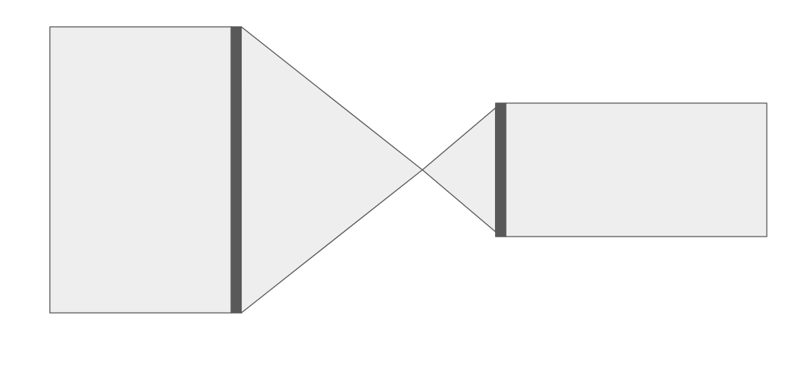
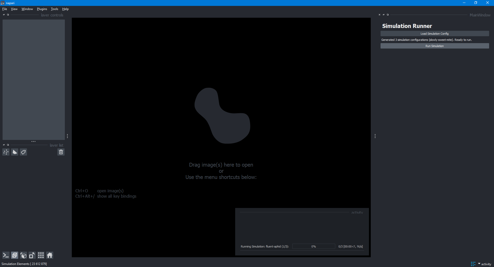

# [PACKAGE_NAME]
 [PACKAGE_NAME] is python package for designing lens by performing full wave simulations.

<figure>
  
  <figcaption style="text-align:center">Simulation Image</figcaption>
</figure>

## Getting Started


### Installation

The best way to install is by creating an [Anaconda](https://docs.conda.io/projects/conda/en/latest/user-guide/getting-started.html) environment. First download and install anaconda.

On Windows - Open Anaconda Powershell Prompt:

On Linux/Mac - Open Terminal:

``` bash
$ git clone https://github.com/DeMarcoLab/lens_simulation.git
$ cd lens_simulation
$ conda create --name lens_sim python=3.8 pip
$ conda activate lens_sim
$ pip install -r requirements.txt
$ pip install -e .

```

### User Interface

To run the user interface:
```bash
$ cd src/lens_simulation
$ python ui/main.py
```

The user interface consists of 6 windows.

The first of these is a home page in which you can open each of the individual components of the user interface.

<figure>
  
  <figcaption style="text-align:center">Home Page</figcaption>
</figure>

Create Lens

Create Beam

Setup Simulation

Run Simulation

Visualise Results

## Tutorial Simulation

The following is a step by step guide on how to design, create, simulate and visualise a simulation using the package user interface.

We are going to be creating a two-lens telescope using two focusing lenses of diameter 300um and 200um respectively.

<figure>
  
  <figcaption style="text-align:center">Tutorial telescope</figcaption>
</figure>

The simulation parameters are global and will inform our design choices. We will be using a pixel size of 0.25um and a simulation size of 500um x 500um.

To start, load the user interface as shown in *User Interface*.

### Creating the Lenses

We will start by creating the lenses to place in the simulation.  By default the units are in micron.
- Press "Create Lens"
- Set the pixel size to 1
- Set the diameter to 300
- Set the lens height to 30
- Set the escape path to 0.1
- Press 'Save Profile' and save the configuration file as 'Tutorial_lens_1.yml' under the src/lens_config folder.

The LensCreator should now look like this:

<figure>
  
  <figcaption style="text-align:center">Lens Creator for Lens 1</figcaption>
</figure>

Now, repeat the process for the second lens, changing the height to 60 and the diameter to 200, and saving the profile in the same location as 'Tutorial_lens_2.yml'.

You can now close the LensCreator interface.

### Creating the beam

The lenses we defined earlier naturally act as apertures, only allowing light through where the profile is defined, so any light outside the lens diameter will be blocked.

Next we will create the beam.  We will be using a planar, circular beam with a diameter of 400um.
- Press "Create beam"
- Set the pixel size to 1
- Set the simulation width to 500
- Set the simulation height to 500
    - Note, the simulation width and height defined in this window have no effect other than for visualisation and construction purposes, the actual parameters will be set in the simulation setup interface.
- Set the simulation width to 400
- Set the simulation width to 400
- Set the lens shape to 'Circular', using the drop-down menu
- Set the propagation distance to 300
- Press 'Calculate final propagation' to visualise the profile of the beam propagation when it enters the first lens
- Press 'Save Profile' and save the configuration file as 'Tutorial_beam.yml' under the src/lens_config folder.

The BeamCreator interface should now look like this:
<figure>
  
  <figcaption style="text-align:center">Beam Creator for tutorial</figcaption>
</figure>


You can now close the BeamCreator interface.

### Setting up the simulation

Now that we have our lenses and beam, we are ready to set them up in a simulation.
- Press 'Setup simulation'
- Set pixel size to 0.25e-6
- Set simulation height to 500e-6
- Set simulation width to 500e-6
- Press the [...] button after 'Sim beam' to load the beam configuration
- Load the 'Tutorial_beam.yml' file you saved earlier
- Set the number of stages to 2

For stage 1:
- Press the [...] button after 'Lens' to load the first lens configuration
- Load the 'Tutorial_lens_1.yml' file saved earlier
- Set the output medium to 1, for air
- Set the n_steps to 50
- Set the step_size to 0 (the simulation defaults to n_steps)
- Set the start distance to 0
- Set the finish distance to 437e-6 (pre-calculated combination of focal distances for lens 1 and 2)

For stage 2:
- Press the [...] button after 'Lens' to load the second lens configuration
- Load the 'Tutorial_lens_2.yml' file saved earlier
- Set the output medium to 1.33, for water
- Set the n_steps to 50
- Set the step_size to 0 (the simulation defaults to n_steps)
- Press 'Use focal distance'
- Set the start distance to 0
- Set the finish distance to 1
    - The simulation will set the propagation finish distance to the focal distance of a 2.0 exponent focusing lens of the same height and diameter for you

- Now that both stages have been defined, press 'Generate' to generate the simulation configuration.
- Press 'Save Simulation' and save the configuration file as 'Tutorial_simulation.yml' under the src/lens_config folder.

The Simulation Setup interface should now look like this:
<figure>
  
  <figcaption style="text-align:center">Simulation Setup for tutorial</figcaption>
</figure>
<figure>
  
  <figcaption style="text-align:center">Simulation Setup for tutorial</figcaption>
</figure>
<figure>
  
  <figcaption style="text-align:center">Simulation Setup for tutorial</figcaption>
</figure>

### Sweeping parameters (Optional)
While we have pre-calculated the finishing distance to match the focal distance of both of the lenses, this may not always be the case.  If you wish simulate a range of propagation distances to find the optimal position of the lenses, you can use a parameter sweep

- While still in the 'Setup Simulation' interface, press 'Setup Parameter Sweep'
- After 'finish distance' in 'Stage 1' enter the three following values
    - 337e-6 (Start)
    - 537e-6 (Stop)
    - 100e-6 (Step)
- This will create 3 simulations, each with a different finish distance for the first stage.

The Simulation Parameter Sweep interface should look like this:
<figure>
  
  <figcaption style="text-align:center">Parameter Sweeping for tutorial</figcaption>
</figure>

- Press 'Save configuration'
- Press 'Save Simulation' and save the configuration file as 'Tutorial_simulation.yml' under the src/lens_config folder.

You can now close the SimulationSetup interface.


### Running your simulation
- Press 'Run Simulation'
- Press 'Load Simulation Config'
- - Load the 'Tutorial_simulation.yml' file saved earlier
- Press 'Run Simulation'
- Note: The simulation will be given a 'pet name', allowing for easier identification of the simulation.  This name will be stated here, note it down to load the simulation later.
- The progress of the simulation will be show in the command line from which you opened the user interface

<figure>
  
  <figcaption style="text-align:center">Simulation running for tutorial</figcaption>
</figure>

- Once the simulation is complete, you can close the 'Run Simulation' interface


### Visualising the results
- Press 'View Results'
- Press 'Load Simulation'
- Locate the folder with the pet-name given during the running of the simulation, and open it
- You should now see the results of your simulation :)
- You can also filter the results by choosing a parameter from the drop down menu.
- Choose the "Stage" parameter
- Enter '2' after the 'Equals to' tab to only visualise the output of the final stage.

For example, using the three finish distances shown earlier, you can see the effect of propagating not far enough, just right and too far.
<figure>
  
  <figcaption style="text-align:center">Visualisation for tutorial</figcaption>
</figure>

<figure>
  
  <figcaption style="text-align:center">Visualisation for tutorial</figcaption>
</figure>

### Examples
The example folder contains a few simulation configurations using common lens types and setups:
 - Focusing Lens (1D and 2D)
 - Axicon Lens (2D)
 - Telescope (1D and 2D)


## Configuration


In the config.yaml file:

### Define your simulation parameters

```yaml
sim_parameters:
  A: 10000
  pixel_size: 1.e-6
  sim_width: 4500.e-6
  sim_wavelength: 488.e-9

```
### Define your lenses
Define the medium and profile for each lens.
```yaml
lenses:
  - name: lens_1
    height: 70.e-6
    exponent: 0.0
    medium: 2.348
```
### Define your simulation stages
Define the stages for the simulation to run. Simulation will be run in the order these stages are defined in.

```yaml
stages:
  - lens: lens_1
    output: 1.0
    n_steps: 100
    start_distance: 0
    finish_distance: 10.0e-3
    options:
      use_equivalent_focal_distance: False
      focal_distance_multiple: 2.0
  - lens: lens_2
    output: 1.33
    n_steps: 1000
    start_distance: 0
    finish_distance: 10.0e-3
    options:
      use_equivalent_focal_distance: True
      focal_distance_multiple: 2.0
```
The name of the lens must match that found in the lenses section.


### Command Line

Simulations can be run from the commmand line.
```bash
$ python run_simulation.py config.yaml
```
This is useful for running large parameter sweeps on HPC setups.


### Technical Details


ZARR


## Citation
TODO