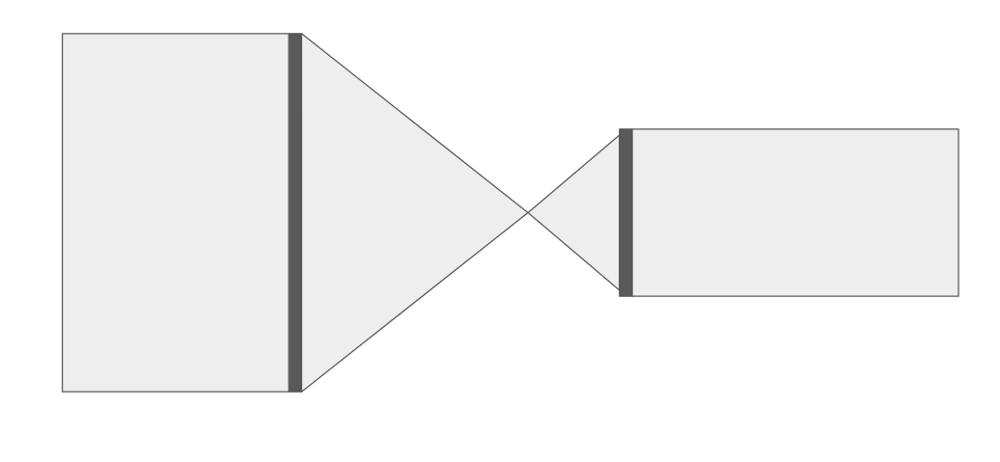
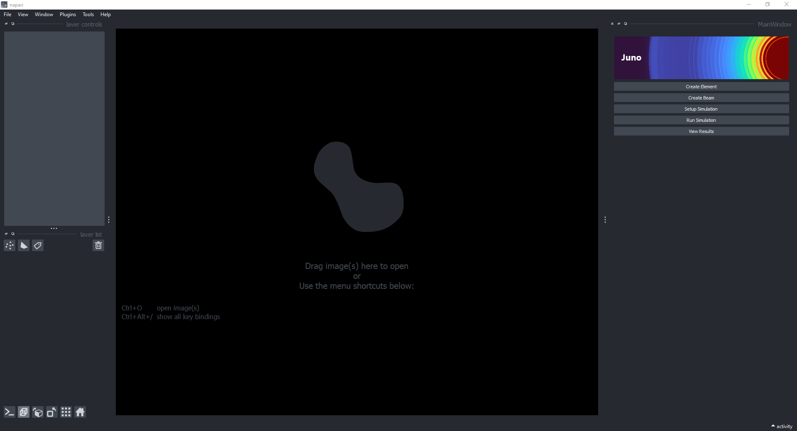
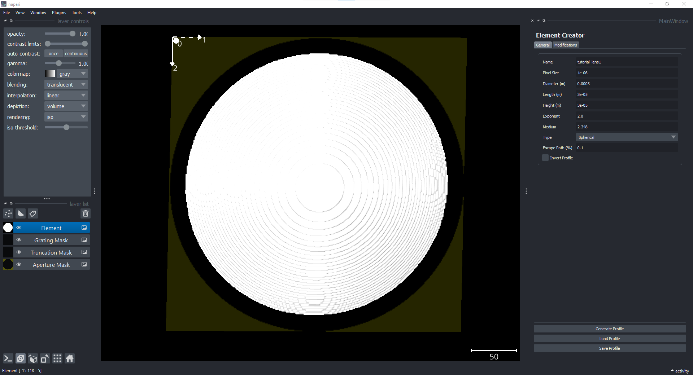
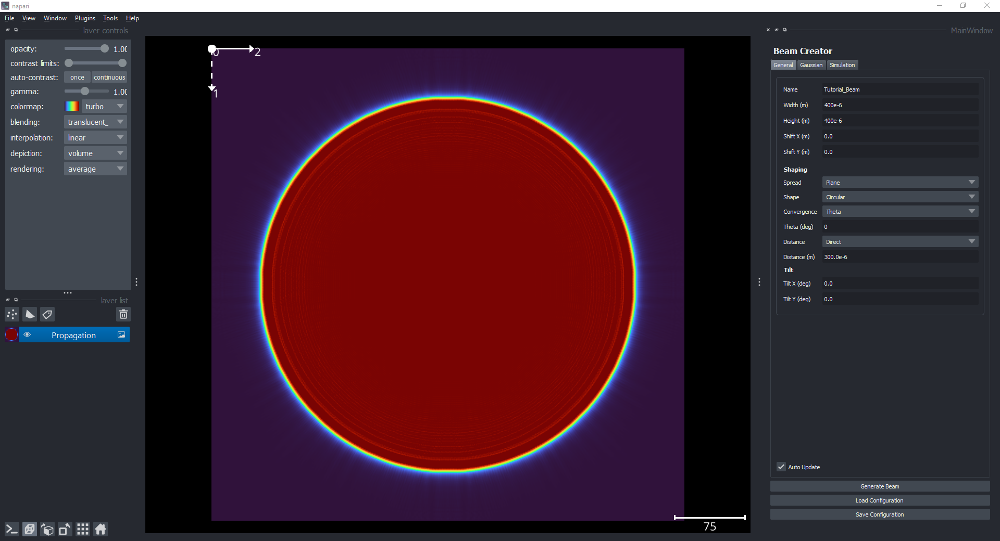
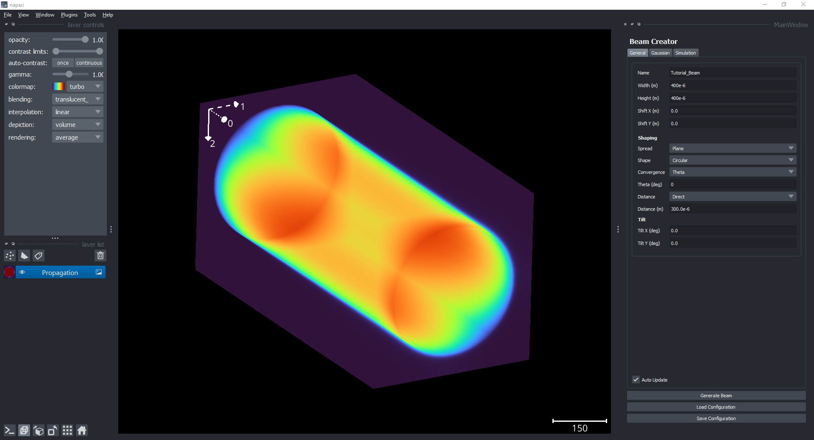
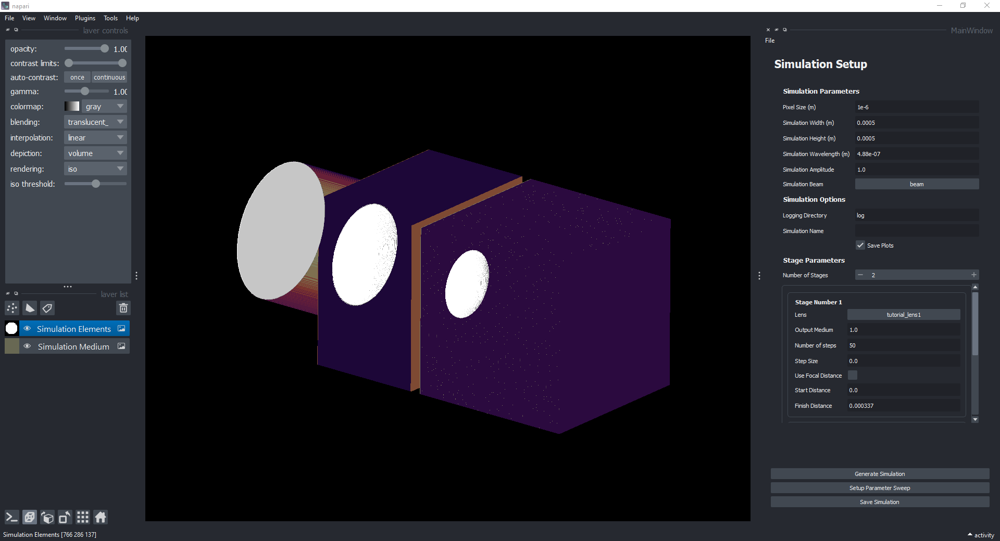
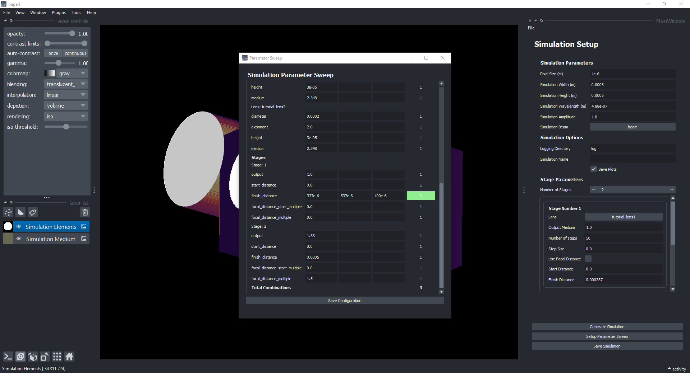
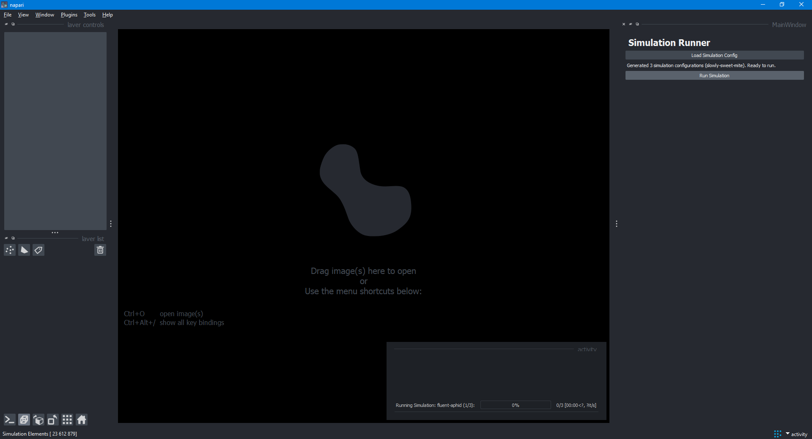
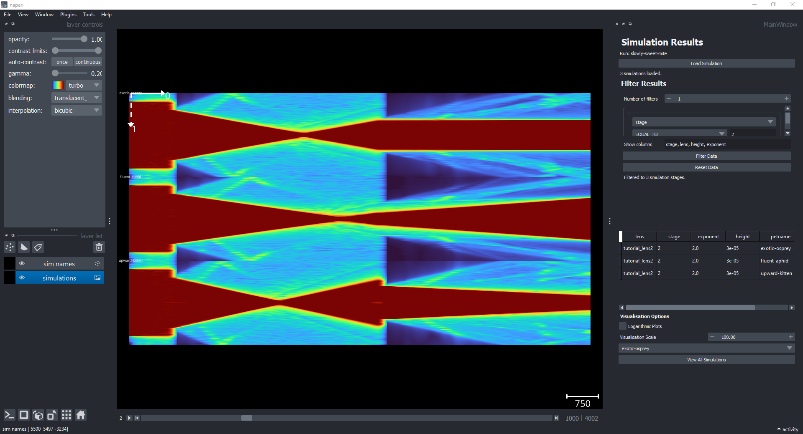
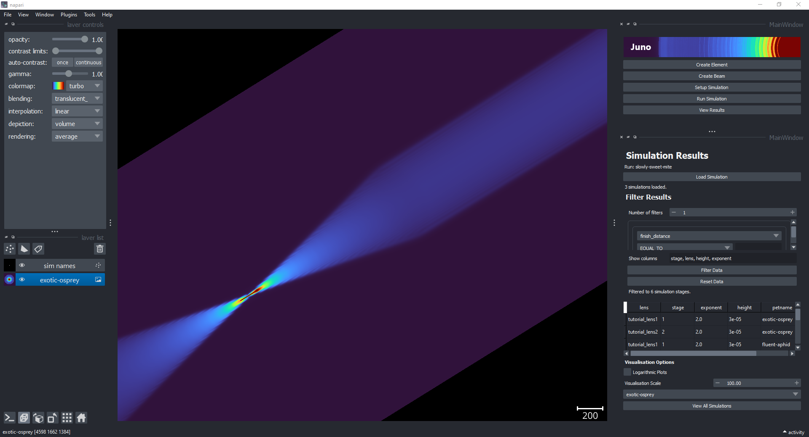

# Simulation Tutorial

The following is a step by step guide on how to design, create, simulate and visualise a simulation using the package user interface.

We are going to be creating a two-lens telescope using two focusing lenses of diameter 300um and 200um respectively.
<figure>
  
  <figcaption style="text-align:center">Tutorial telescope</figcaption>
</figure>

The simulation parameters are global and will inform our design choices. We will be using a pixel size of 0.25um and a simulation size of 500um x 500um.

To start, load the user interface as shown in *User Interface*. 

```bash
$ juno_ui
```

You will see the following launcher open:

<figure>
  
  <figcaption style="text-align:center">Juno Launcher</figcaption>
</figure>


## Creating the Lenses

We will start by creating the lenses to place in the simulation.  By default the units are in micron.
- Press "Create Element"
- Set the pixel size to 1e-6
- Set the diameter to 300e-6
- Set the lens height to 30e-6
- Set the escape path to 0.1
- Press "File -> Save Configuration" and save the configuration file as 'tutorial_lens_1.yml' under the config folder.

You should now be able to rotate the lens element in 3D, so the interface now looks similar to this:

<figure>
  
  <figcaption style="text-align:center">Lens Creator for Lens 1</figcaption>
</figure>

Now, repeat the process for the second lens, changing the height to 60e-6 and the diameter to 200e-6, and saving the profile in the same location as 'tutorial_lens_2.yml'.

You can now close the Element Creation interface.

## Creating the beam

The elements we defined earlier naturally act as apertures, only allowing light through where the profile is defined, so any light outside the element diameter will be blocked.

Next we will create the beam.  We will be using a planar, circular beam with a diameter of 400um.
- Press "Create Beam"

On the General Tab
- Set the beam width to 400e-6
- Set the beam width to 400e-6
- Set the shape to 'Circular', using the drop-down menu
- Set the Distance to 300e-6

On the Simulation Tab:
- Set the pixel size to 1e-6
- Set the simulation width to 500e-6
- Set the simulation height to 500e-6
    - Note, the simulation width and height defined in this window have no effect other than for visualisation and construction purposes, the actual parameters will be set in the simulation setup interface.

Press "Generate Beam" to generate the beam propagation. 

The Beam Creation interface should now look like this:
<figure>
  
  <figcaption style="text-align:center">Tutorial Beam Creation</figcaption>
</figure>

You can rotate the beam propagation to interact with and visualise it in 3D. 

<figure>
  
  <figcaption style="text-align:center">3D Beam Visualisation</figcaption>
</figure>

Once complete:
- Press "File -> Save Configuration" and save the configuration file as 'tutorial_beam.yml' under the config folder.


## Setting up the simulation

Now that we have our elements and beam, we are ready to set them up in a simulation.
- Press 'Setup Simulation'
- Set pixel size to 0.25e-6
- Set simulation height to 500e-6
- Set simulation width to 500e-6
- Press the [...] button after 'Sim beam' to load the beam configuration
- Load the 'tutorial_beam.yml' file you saved earlier
- Set the number of stages to 2

For stage 1:
- Press the [...] button after 'Lens' to load the first lens configuration
- Load the 'tutorial_lens_1.yml' file saved earlier
- Set the output medium to 1, for air
- Set the n_steps to 50
- Set the step_size to 0 (the simulation defaults to n_steps)
- Set the start distance to 0
- Set the finish distance to 437e-6 (pre-calculated combination of focal distances for lens 1 and 2)

For stage 2:
- Press the [...] button after 'Lens' to load the second lens configuration
- Load the 'tutorial_lens_2.yml' file saved earlier
- Set the output medium to 1.33, for water
- Set the n_steps to 50
- Set the step_size to 0 (the simulation defaults to n_steps)
- Set the 'Use Focal Distance' checkbox.
- Set the Start Multiple to 0
- Set the Finish Multiple to 1
    - The simulation will set the propagation finish distance based on the equivalent focal distance of a focusing lens of the same height and diameter 

- Now that both stages have been defined, press 'Generate Simulation' to generate the simulation configuration. Depending on your computer, this might take a while.

You can now rotate the visualisation so that the interface should now look something like this:
<figure>
  
  <figcaption style="text-align:center">Simulation Setup for tutorial</figcaption>
</figure>

- Press "File -> Save Configuration" and save the configuration file as 'tutorial_simulation.yml' under the config folder.


## Sweeping parameters (Optional)
While we have pre-calculated the finishing distance to match the focal distance of both of the lenses, this may not always be the case.  If you wish simulate a range of propagation distances to find the optimal position of the lenses, you can use a parameter sweep

- While still in the 'Setup Simulation' interface, press 'Setup Parameter Sweep'
- After 'finish distance' in 'Stage 1' enter the three following values
    - 337e-6 (Start)
    - 537e-6 (Stop)
    - 100e-6 (Step)
- This will create 3 simulations, each with a different finish distance for the first stage.

The Simulation Parameter Sweep interface should look like this:
<figure>
  
  <figcaption style="text-align:center">Parameter Sweeping for tutorial</figcaption>
</figure>

- Press 'Save configuration'
- Press "File -> Save Configuration" and save the configuration file as 'tutorial_simulation.yml' under the config folder.


## Running your simulation
- On the Launcher, press 'Run Simulation'
- Press 'Load Simulation Config'
- - Load the 'tutorial_simulation.yml' file saved earlier
- Press 'Run Simulation'
- Note: The simulation will be given a 'pet name', allowing for easier identification of the simulation.  This name will be stated here, note it down to load the simulation later. You can also set the name manually in the Simulation Setup interface.
- The progress of the simulation will be show in the command line from which you opened the user interface.

<figure>
  
  <figcaption style="text-align:center">Simulation running for tutorial</figcaption>
</figure>

The simulations will take around 5mins to complete on a standard laptop.


## Visualising the results
- On the Launcher, press 'View Results'
- Press 'Load Simulation'
- Locate the folder with the pet-name given during the running of the simulation, and open it
- You should now see the results of your simulation :)
- You can also filter the results by choosing a parameter from the drop down menu. The simulation data is also displayed in a table, which you can customise the columns shown.
- You can change the scale of the 0 axis, by changing the Visualisation Scale. Change it to 100 for these simulations, and then press View All Simulations. 

The visualistion shows us all three simulations are once. This is useful for comparing the effects of changing parameters. For example, using the three finish distances shown earlier, you can see the effect of propagating not far enough, just right and too far.

<figure>
  
  <figcaption style="text-align:center">Multi-Simulation Visualisation</figcaption>
</figure>

Play around with the visualisation options on the left, and see how they change the propagation visualisation.

You can also view these simulations in 3D, and interact with them (press the toggle ndisplay (Ctrl + Y) button near the bottom left corner). However, viewing multiple simulations in 3D can require a powerful computer.

To show only one simulation, select it using the dropdown at the bottom right corner of the screen. The visualisation will automatically update to the selected simulation. You are now free to visualise and explore this simulation in 3D. 

<figure>
  
  <figcaption style="text-align:center">Single Simulation 3D Visualisation</figcaption>
</figure>

Thanks for completing the Juno tutorial. You should now be ready to get started simulating on your own. For more examples, please see the example folder in the repository. This contains a number of example configurations you can load and run to play around with the package.

If there are any issues with this tutorial, or the package in general, please open an issue on [GitHub](https://github.com/DeMarcoLab/juno/issues). 