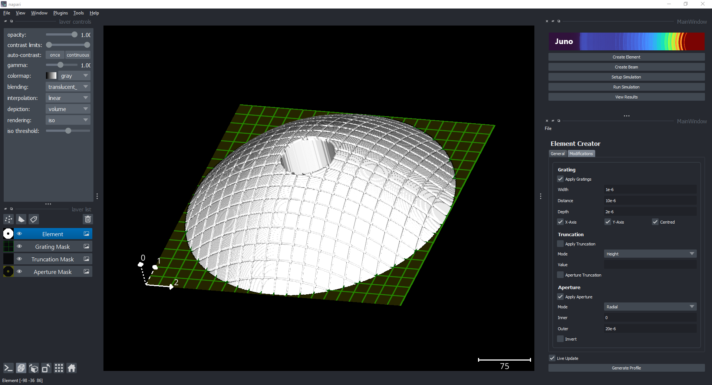
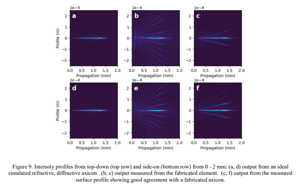
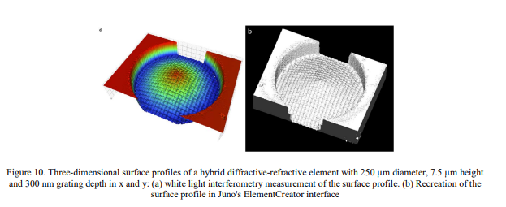
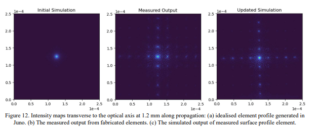

# Juno
juno is a simulation package for optics design using full wave propragation.

## Overview

Fluorescence microscopy is a widely used tool in the field of structural biology, providing researchers with the ability to visualize and study the structure of biological molecules in real-time and within their natural cellular environment. This technique involves labeling specific molecules with fluorescent probes, allowing them to emit light when excited by specific wavelengths of light. This light emission can be captured by a microscope, producing high-resolution images that reveal the molecular structure and interactions of biological systems.

In-situ fluorescence microscopy, specifically, refers to the use of fluorescence microscopy to study biological systems in their native state within the cell, rather than in vitro or after purification. This approach provides a more accurate representation of biological systems in their natural environment, and enables the study of dynamic processes such as protein localization, movement, and interaction within cells. Additionally, in-situ fluorescence microscopy allows for the study of cells and tissues in their natural three-dimensional state, providing a more complete picture of the complex interactions that occur within biological systems.

Many different system designs, and excitation strategies are possible, each with different benefits and trade-offs. Researchers are  interested in designing optical elements and systems that provide maximum performance, and/or minimise the trade-offs, such as increasing resolution without excessive photo-damage or cost. 

Simulation is an important tool for analyzing the trade-offs between different element designs for fluorescence microscopy, as it provides a means to predict and optimize the performance of a microscope before it is physically built. By using simulations, researchers can study the behavior of light in different element and system designs, taking into account various factors. In addition, simulation provides a cost-effective method for researchers to explore novel element designs, and analyse how these new elements will behave without having to exhaustively understand the underlying physics. 

However, commercial simulation options are often focused exclusively on optimisation (not exploration) and are expensive, and exisiting open source package are usually application specific, require programming scripts and have a high overhead. 

For these reasons we developed Juno; a python simulation package for optical system design. We designed the package with ease of use, exploration and research flexibility in mind. With Juno, researchers can design new optical elements, construct simulations, and visualise results from a single user interface with no programming required. More advanced users can construct their own custom optical elements, or propagation methods (with programming experience) and use them natively in the simulation interface. 

## Advantages
We believe Juno provides the following advantages over existing solutions:

### Ease of Use

User-Friendly Interface
Juno has been designed with ease of use in mind, allowing users to take advantage of its capabilities without the need for programming or optics experience. The entire application can be used through its user interface, making it accessible to a wide range of users and reducing the barrier to entry. This makes it an ideal tool for researchers who are looking to explore new ideas and strategies, as well as those who are new to the field.



Juno is designed to run on a personal computer, eliminating the need for large computational resources. This makes it an accessible option for researchers who may not have access to extensive computational resources, but still want to take advantage of its capabilities. However, if users do want to increase the size of their simulations, they do not need to rewrite any code. This makes it a versatile tool for researchers who may be working on projects that require significant computational resources, but still want to take advantage of its ease of use and low barrier to entry.

### Computational Scalability

The wave propagation method supported by Juno is a numerical simulation, which often requires very high resolution simulation to produce accurate results. However, when a user tries to run a large simulation on their laptop / desktop it will often crash if the simulation tries to allocate more memory than is available. This either results in the user scaling down the simulation, utilising expensive HPC resources, or using memory management techniques that reduce computational efficiecy (the sim is a big matrix multiply). In addition, it usually forces the researcher to perform small scale simulations on their device to check everything is working, before scaling up which can produce numerical issues, and is time-consuming. 

Juno utilises three libraries (zarr, dask and napari) to enable scalability. Zarr and Dask allow efficient storage and lazy processing for large arrays (larger than memory), allowing higher resolution simulations to be run than would be possible with standard array libraries (numpy) on a personal laptop. This means the user can run at the resolution they want, without worrying about memory issues. 

For visualisation, napari natively supports zarr/dask arrays enabling interactive visualisation of large arrays. This means the research can visualse the entire simulation, without having to rely on downscaling results, or taking 'slices' through the simulation.  


When HPC resources are available, the researcher can run large sweeps on the hardware using the exact same configuration they used on their laptop, and then transfer results back to their laptop for offline analysis. We believe this results in much greater 'researcher utilisation', as the researcher can perform analysis, or set up new simulations while a sweep runs, and doesn't have to wait for additional visualisation cluster resources to analyse their results.  

In future, we will be upgrading the package with the following performance improvements:
- GPU acceleration on main simulation propagation calculations.
- Native support for parallelising simulation sweeps on HPC.
- Native supprot for caching simulation stage propagation for re-use.
- Better visualisation performance for multiple simulation results

### Research Flexibility

Juno is an open source project designed with the needs of researchers in mind. The project aims to provide a high degree of flexibility, allowing researchers to explore different ideas and strategies, customise and extend the current functionality as needed.

The design of Juno is such that inputs and outputs are represented as arrays. This provides users with the ability to provide custom arrays as input (such as custom lenses) and use the output as a basis for building customised analytical tools. For example, researchers can use Juno as a simulation engine and experiment management tool, but not be constrained by its limitations.

As an open source project, users have the ability to replace any part of the simulation they wish with their own methods. For example, they can swap the propagation method if desired, and use the other tools around it. This gives researchers the freedom to pursue their research direction in the way they see fit.

Users can build customised analytical tools on top of Juno as the output is represented as an array. This allows researchers to take advantage of the simulation engine and experiment management capabilities of Juno while still having the freedom to develop their own analysis tools. For example, the light sheet case study used analytical tools built on top of Juno.

### Experiment Management
Juno provides researchers with a native experiment management system that helps them keep track of and compare results across simulations. With this system, researchers can easily manage and organize their experiments, saving time and effort in the process.

One of the key features of Juno is its inbuilt parameter sweep tools, which allow users to iterate through many different designs for exploration and optimization. This feature makes it easy for researchers to test multiple scenarios and find the best solution for their needs.


Simulations performed in Juno retain the configuration and metadata used during the run, so users are able to review or re-run simulations as needed. This feature makes it easy for researchers to keep track of their work, and quickly make changes or adjustments as necessary.

Multiple simulation results can be viewed in the user-friendly interface of Juno, and all configurations are exportable to a standard csv format for easy analysis in other tools. This feature makes it easy for researchers to share their results with others, or to use other analysis tools to further explore their data. The native experiment management system, in combination with the parameter sweep tools and the ability to retain configuration and metadata, make Juno an effective tool for helping researchers manage their experiments and achieve their research goals.

## Case Studies
Internally we have used Juno for the following case studies:

### Verification and Validation (Diffraction Gratings)

In the case study discussed in the paper, we use Juno to examine the performance divergence between idealized and real fabricated diffraction gratings. The aim of this study was to understand the discrepancy between simulated and actual performance and find a way to resolve it.

As shown in Figure 9, we observed that the fabricated gratings significantly diverged from the idealized simulation gratings. This resulted in unreliable simulation performance and a need for a solution.




To resolve the issue, we used interferometry measurements of the fabricated element and imported the profile into Juno (Figure 10). These measurements revealed that the manufactured gratings had sloped walls compared to the perfect square simulation gratings.



With the help of Juno, we were able to re-simulate the system using the measured gratings and achieved better simulation performance (Figure 12). They also added the ability for users to apply these more realistic gratings to their elements in Juno, further reducing the discrepancy between simulated and actual performance.




The case study demonstrates the usefulness of Juno in resolving performance divergence in diffraction gratings. By allowing users to apply more realistic gratings to their elements, Juno provides a better understanding of the actual performance of the system, making it a valuable tool for researchers in this field. 

We hope that Juno will provide a way to better iterate system design, and speed up the loop between conceptual design and real world performance. 

### Novel Element Design
- Custom Elements, post-simulation analysis tool (David) 


---


## Getting Started

For more information, please see:

- Paper: https://arxiv.org/abs/2212.12540

- Code: https://github.com/deMarcoLab/juno

- Please see, [Getting Started](started.md)

### Feedback and Issues
If you have any feedback, or bugs to report please open an issue on [Github](https://github.com/DeMarcoLab/juno/issues)

### Citation
If you find the package useful to your research, please cite us:
```
@misc{https://doi.org/10.48550/arxiv.2212.12540,
  doi = {10.48550/ARXIV.2212.12540},
  
  url = {https://arxiv.org/abs/2212.12540},
  
  author = {Dierickx, David and Cleeve, Patrick and Gorelick, Sergey and Whisstock, James C. and De Marco, Alex},
  
  keywords = {Instrumentation and Detectors (physics.ins-det), Numerical Analysis (math.NA), Optics (physics.optics), FOS: Physical sciences, FOS: Physical sciences, FOS: Mathematics, FOS: Mathematics},
  
  title = {Juno: a Python-based graphical package for optical system design},
  
  publisher = {arXiv},
  
  year = {2022},
  
  copyright = {Creative Commons Attribution Share Alike 4.0 International}
}

```